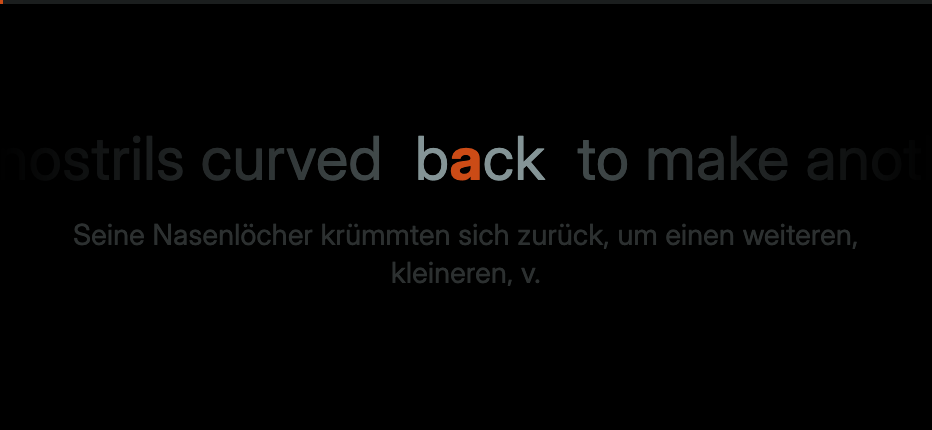

# Ullada

A minimalist, Progressive Web App (PWA) designed for Rapid Serial Visual Presentation (RSVP) reading of EPUB files. It uses a pure black background and the Solarized color palette to minimize eye strain on OLED displays.

Based on essentially the same thing, but on hardware by John Decebal, published on Instagram [here](https://www.instagram.com/p/DXZtfjNDU4b/?hl=en).

## Features

* **Optimal Recognition Point (ORP):** Words are aligned dynamically based on their length, highlighting the pivot letter in Solarized Orange to keep your eye perfectly anchored.
* **Peripheral Context Window:** Smoothly faded previous and upcoming words provide a lookbehind/lookahead buffer, mitigating the "tunnel vision" effect of traditional RSVP.
* **Pacing Engine:** Automatically adds slight delays for punctuation (commas, periods) and exceptionally long words, mirroring natural reading cadence.
* **Smart Chapter Navigation:** Parses the EPUB spine to automatically detect chapter boundaries and titles, allowing you to easily skip front matter or jump between sections.
* **Language Learning Mode:** Load a pre-translated `.ullada` file to display each sentence's translation in dim text below the flashing word — useful for vocabulary immersion in a foreign language.
* **100% Client-Side:** Uses JSZip to parse EPUB archives entirely within the browser. No server required.
* **Distraction-Free:** Invisible UI with pure gesture-based controls.

## Controls & Gestures

The reader view hides all UI elements. Interact anywhere on the screen:

* **Tap / Click:** Play or Pause reading.
* **Double-Tap Edges:** Double tap the left 20% or right 20% of the screen to jump to the previous or next chapter.
* **Hold & Drag Vertically:** Adjust reading speed (WPM) on the fly. Drag up to read faster, drag down to slow down.
* **Swipe Horizontally:** Scrub the timeline. Swipe left to rewind 50 words (if you missed a sentence), swipe right to fast-forward.
* **Keyboard Support:** Spacebar (Play/Pause), Up/Down Arrows (Adjust WPM), Left/Right Arrows (Jump 20 words).

## Translation Workflow

Translation happens on desktop (Chrome 138+) and is pre-computed — the reading device never needs internet or AI.

1. Open `translate.html` in Chrome 138 or later.
2. Load an EPUB, choose source and target languages, and click **Translate**. Translation runs locally using Chrome's built-in AI; a full novel takes 20–40 minutes.
3. Download the resulting `.ullada` file when done (or at any point — partial files work).
4. On any device, open Ullada and load the `.ullada` file directly (no EPUB needed). The file is self-contained: words, chapters, cover art, and translations are all bundled together.

## File Formats

* **`.epub`** — standard ebook format, loaded directly into the reader.
* **`.ullada`** — Ullada's self-contained reading format. JSON file produced by the translator tool; includes the full parsed book (words, chapters, cover) plus sentence-level translations. Can be loaded in place of an EPUB.

## Technical Stack

* HTML5 / Canvas API
* Tailwind CSS (via CDN)
* [JSZip](https://stuk.github.io/jszip/) for EPUB parsing
* Chrome Built-in Translator API (translator tool only, desktop Chrome 138+)
